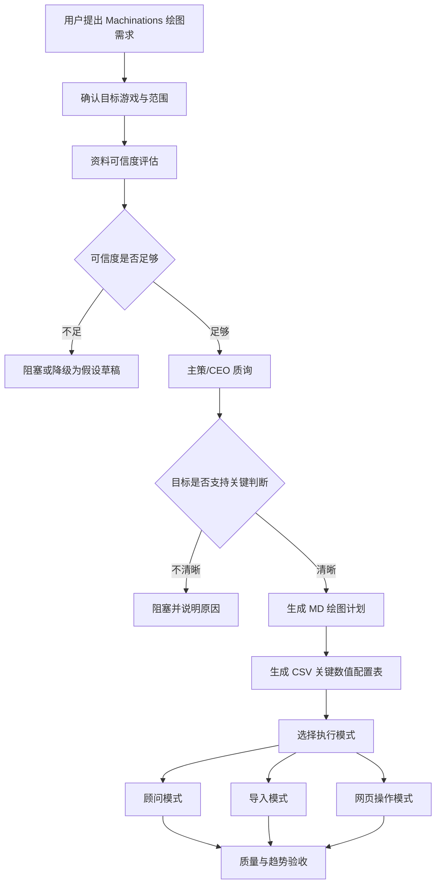

# Machinations Diagram Assistant Skill 设计

## 背景与定位

`machinations-diagram-assistant` 是面向游戏系统策划的 Machinations 绘图辅助 Skill。它的目标不是直接把任意游戏内容画成流程图，而是先判断资料是否足够、研究目标是否值得画，再生成可执行的 Machinations 绘图计划，并按用户选择进入顾问、导入或网页操作模式。

该 Skill 适用于以下场景：

- 研究目标游戏的经济循环、养成循环、关卡循环、商业化循环或社交循环。
- 将复杂系统拆成 Machinations 可表达的资源、状态、限制、转化和反馈关系。
- 为主策、系统策划、数值策划或项目负责人提供可讨论、可复核、可继续调整的系统图。
- 在可行时辅助创建 Machinations 图，包括导入结构、复制模板或网页操作。

该 Skill 不承诺在资料不足、目标不清晰或网页自动化条件不满足时强行完成绘图。它必须把不确定性、假设和执行失败边界显式暴露出来。

## 总体流程

Skill 采用门禁式流程，所有执行模式共享同一套前置分析。



流程阶段：

1. 确认目标游戏与研究范围。
2. 评估知识库和网络资料丰富度，输出 0-100 的可信度评分。
3. 以严格 CEO/主策视角进行 1-3 轮反问质疑。
4. 目标通过后生成 MD 绘图执行计划。
5. 同步生成本地 CSV 关键数值配置表。
6. 选择顾问模式、导入模式或网页操作模式。
7. 完成后进行 Machinations 图质量、趋势和仿真验收。

## 目标游戏确认

Skill 必须先确认以下信息：

- 游戏名：必须避免同名、续作、地区版本或渠道版本混淆。
- 研究版本：正式服、测试服、某赛季、某活动版本或历史版本。
- 系统范围：经济、养成、战斗、社交、商业化、活动、任务或其他明确系统。
- 分析对象：完整游戏循环、单个玩法模块、竞品机制、数值结构或对外汇报图。

如果用户只给出模糊游戏名或模糊系统，例如“研究某游戏的成长系统”，Skill 必须先追问具体版本和范围，不得直接开始资料搜索和绘图。

## 资料可信度评分

资料可信度评分用于判断 AI 是否可以承担知识库支持和分析判断。评分范围为 0-100：

| 分数段 | 含义 | 允许动作 |
| --- | --- | --- |
| 0-20 | 几乎找不到目标游戏资料，或来源明显混乱 | 阻塞，不进入绘图 |
| 21-50 | 有零散资料，但缺少互证或关键玩法信息 | 只能生成假设型草稿 |
| 51-75 | 可建立系统结构，但存在关键不确定项 | 可生成分析计划，必须标注假设 |
| 76-90 | 资料较充足，可进入正式绘图 | 可执行 MD 计划和绘图 |
| 91-100 | 官方、社区和实测资料高度一致 | AI 可主导提出结构判断和优化建议 |

评分依据：

- 来源广度：官方公告、开发者访谈、游戏内截图、百科、社区攻略、视频拆解、玩家实测是否覆盖完整。
- 互证程度：多个来源是否指向一致的系统规则、数值、入口、奖励、消耗和限制。
- 可信来源占比：官方、游戏内、开发者或高质量实测资料占比越高，分数越高。
- 玩法细节完整度：是否能支撑 Machinations 节点、连接、流速、触发条件和资源变化。
- 时效性：资料是否对应当前目标版本，是否存在版本迭代或活动规则变化。

社区资料可以作为主要依据，但必须互相印证。若社区资料互相矛盾，Skill 必须列出冲突来源和待确认问题，不得选择性采信。

## CEO/主策质询门禁

资料通过后，Skill 必须进入强质询门禁。这个阶段的目标是判断这张 Machinations 图是否服务真实决策，而不是只把系统画得好看。

质询原则：

- 每轮只问一个尖锐问题。
- 每轮必须指出当前目标的空洞点、决策价值不足或表达对象不清晰之处。
- 总轮数为 1-3 轮。
- 如果 1-3 轮后仍无法回答“这张图支持哪个关键设计或商业判断”，必须阻塞绘图。

质询方向：

- 为什么这张图值得画？
- 它服务哪个设计、数值、商业化或项目管理判断？
- 谁会看这张图，读完后需要做什么决定？
- 如果不画这张图，当前团队会在哪个问题上继续低效或误判？
- 这张图要证明、反驳或暴露什么？

通过条件：

- 用户明确研究目标。
- 用户明确受众或使用场景。
- 用户明确这张图要支持的判断或讨论。
- Skill 能把目标转译为 Machinations 可表达的系统边界和变量关系。

## MD 绘图计划

通过门禁后，Skill 创建 MD 绘图计划。该文档是后续三种执行模式的共同契约。

建议文件名：

```text
artifacts/machinations/<game-or-system-slug>-machinations-plan.md
```

MD 计划必须包含：

- 研究目标：用户最终确认的分析目标和决策问题。
- 可信度评分：总分、评分理由、主要来源、冲突信息和盲区。
- 质询结论：CEO/主策质询后的目标收敛结果。
- 系统边界：纳入和排除的系统、资源、玩法阶段、版本范围。
- 核心循环：系统主要循环、分支循环、正反馈和负反馈。
- 节点清单：每个节点的设计含义和 Machinations 表达方式。
- 连接清单：节点之间的资源流、状态流、条件流和反馈流。
- 参数假设：无法确认但需要暂定的数值。
- 图层布局建议：主循环、辅助循环、约束模块、输出结果的空间布局。
- 执行模式建议：顾问、导入或网页操作的推荐理由。
- 待确认项：会影响结构、数值或结论的问题。

节点清单必须包含 Machinations 执行字段：

| 字段 | 说明 |
| --- | --- |
| node_id | Skill 内部稳定 ID |
| display_name | Machinations 图中显示名称 |
| machinations_type | Source、Pool、Drain、Gate、Converter、Register、State Connection 等 |
| design_meaning | 节点在游戏系统中的策划含义 |
| group | 建议图层或模块分组 |
| x / y | 建议坐标或相对布局 |
| initial_value | 初始值 |
| flow_rate_or_formula | 流速、公式或变化规则 |
| trigger_condition | 触发条件 |
| label | 图上备注文案 |
| confidence | 该节点资料可信度 |

连接清单必须包含：

| 字段 | 说明 |
| --- | --- |
| edge_id | Skill 内部稳定 ID |
| from_node | 起点节点 |
| to_node | 终点节点 |
| connection_type | Resource、State、Trigger、Modifier 等 |
| direction | 连线方向 |
| formula_or_condition | 公式、概率、条件或节奏 |
| design_meaning | 该连接表达的系统关系 |
| confidence | 该连接资料可信度 |

## CSV 关键数值配置表

Skill 必须在 MD 计划旁边生成本地 CSV 配置表，用于承接来源数值、假设值、可调参数和复核状态。该表方便用户直接改配置来沟通，也方便后续做数值复核和仿真趋势检查。

建议文件名：

```text
artifacts/machinations/<game-or-system-slug>-machinations-config.csv
```

CSV 字段：

| 字段 | 说明 |
| --- | --- |
| key | 稳定参数名，使用英文或团队约定缩写 |
| display_name | 中文展示名 |
| system_area | 所属系统或模块 |
| node_or_edge_id | 对应 MD 中的节点或连接 |
| value | 当前采用值 |
| unit | 单位，例如 seconds、items、currency、percent、per_day |
| source_type | official、community、video、wiki、user、assumption |
| source_ref | 来源链接、文档名、截图名或用户确认记录 |
| confidence | 该数值可信度 0-100 |
| min_value | 可调最小值 |
| max_value | 可调最大值 |
| default_value | 默认值 |
| notes | 解释、枚举、公式或限制 |
| review_status | confirmed、needs_review、assumption、conflict |

CSV 使用规则：

- 任何进入图中公式、流速、概率、上限、冷却、产出、消耗的关键数值，都必须进入 CSV。
- 无来源数值必须标记为 `assumption`，不能写成确认值。
- 来源冲突的数值必须标记为 `conflict`，并在 MD 的待确认项中说明。
- 用户后续修改 CSV 后，Skill 应基于 CSV 重新解释影响，不应只改图面文字。

## 执行模式

### 顾问模式

顾问模式不直接操作网页，而是基于 MD 和 CSV 指导用户或 AI 在 Machinations 中手动创建。

适用场景：

- 用户希望先讨论结构，不急于自动创建。
- 浏览器自动化不可用。
- 资料可信度只达到 51-75，需要用户边确认边画。
- Machinations 页面结构或导入格式不明确。

输出要求：

- 分步骤创建节点。
- 每一步说明节点类型、名称、位置、初始值和连接。
- 每个阶段说明用户应检查什么。
- 遇到不确定项时暂停确认。

### 导入模式

导入模式尝试生成 Machinations 支持的导入、模板、JSON、复制粘贴结构或其他批量创建资产。

执行前置：

- 研究当前 Machinations 是否支持导入格式、模板、复制粘贴图结构或 API。
- 如果支持，优先生成结构化资产。
- 如果不支持，说明限制，并询问是否切换顾问模式或网页操作模式。

输出要求：

- 生成导入资产或复制粘贴内容。
- 明确导入步骤。
- 明确导入后需要人工检查的节点、连线、公式和布局。

### 网页操作模式

网页操作模式在用户确认目标项目、登录态和授权后，尝试操作 Machinations 网页创建节点与连线。

执行前置：

- 用户确认要操作的 Machinations 项目或文件。
- 用户确认当前环境具备浏览器控制能力。
- 用户确认登录态和权限可用。
- Skill 复述将创建或修改的内容，获得确认后再执行。

安全规则：

- 不得在未确认目标项目时操作网页。
- 不得在页面状态不明时盲目点击。
- 每个关键批次后复述已创建内容。
- 失败时停止，输出当前进度、失败原因和可恢复步骤。
- 不得为了完成绘图而跳过来源冲突、数值冲突或目标不清晰问题。

## 错误处理

必须阻塞的情况：

- 目标游戏无法确认。
- 资料可信度为 0-20。
- 用户无法明确绘图支持的关键判断。
- Machinations 图的系统边界无法定义。
- 自动化模式无法确认目标项目或登录态。

允许降级的情况：

- 可信度为 21-50：只能生成假设型草稿，不进入正式绘图。
- 可信度为 51-75：可生成 MD 和 CSV，但必须突出待确认项。
- 导入格式不可用：可切换到顾问模式或网页操作模式。
- 网页自动化失败：停止当前操作，保留 MD、CSV 和已完成进度。

资料冲突处理：

- 列出冲突事实。
- 标明各自来源。
- 判断冲突是否影响节点、连接或数值。
- 影响核心结构时必须询问用户。
- 只影响非关键参数时可标 `needs_review` 继续。

## 质量验收

完成后的验收不只检查“图是否画出来”，还要检查它是否能回答最初的主策问题。

结构验收：

- 核心循环是否闭合。
- Source 和 Sink 是否解释关键资源的产生与消耗。
- Pool 或状态节点是否承载关键变量。
- Gate 或 Converter 是否表达限制、转化和条件。
- 正反馈、负反馈和瓶颈是否可见。
- 图能否回答最初确认的设计或商业判断。

参数验收：

- 关键参数是否进入 CSV。
- 参数是否有来源、单位、范围和复核状态。
- 假设值是否明确标注。
- 参数变化是否能映射到图中节点或连接。

趋势与仿真验收：

- 正常循环：关键资源和状态是否按预期稳定流转。
- 资源过剩：是否能看出产出过高、消耗不足或反馈放大。
- 资源枯竭：是否能看出断流、卡点或恢复机制不足。
- 转化瓶颈：是否能看出限制条件、概率、冷却或容量造成的阻塞。

如果 Machinations 支持仿真并且当前环境可读取结果，Skill 应记录仿真结果。如果不能运行或不能读取仿真，Skill 必须在 MD 中记录预期趋势和待验证假设，不能宣称已完成仿真验收。

## 非目标

首版不处理以下内容：

- 不自动绕过 Machinations 登录、付费、权限或安全限制。
- 不承诺对所有游戏都能给出高可信度评分。
- 不在资料不足时替用户补全不存在的官方规则。
- 不直接修改用户已有 Machinations 项目，除非用户明确选择网页操作模式并确认目标项目。
- 不把 CSV 当作最终数值平衡工具；它是绘图和复核的配置承接表。

## 后续实现建议

实现 Skill 时建议先落地以下文件：

- `.cursor/skills/machinations-diagram-assistant/SKILL.md`
- `.cursor/skills/machinations-diagram-assistant/reference.md`
- `.cursor/skills/machinations-diagram-assistant/agents/openai.yaml`
- 可选脚本：生成 MD 计划模板、初始化 CSV、校验 MD/CSV 一致性。

实现顺序建议：

1. 先实现只读分析与门禁流程。
2. 再实现 MD 和 CSV 模板产出。
3. 再研究 Machinations 导入格式可行性。
4. 最后再加入网页操作模式，并将其设为显式选择入口。
